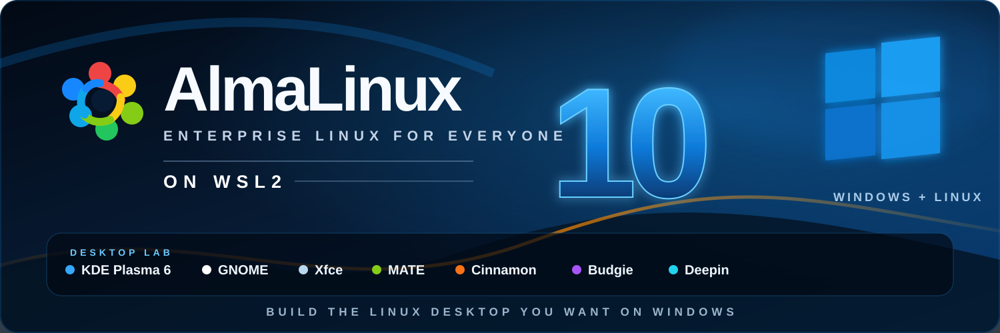

<div align="center">



# 🌀 AlmaLinux 10 for WSL

### Build the Linux desktop you want on Windows

Run a clean **AlmaLinux 10** environment inside **WSL2**, then build your preferred desktop environment on top of it.

**KDE Plasma • GNOME • Xfce • MATE • Cinnamon • and more**

[](https://almalinux.org/)
[](https://learn.microsoft.com/windows/wsl/)
[](https://github.com/vinberg88/almalinux/releases/latest)
[](https://github.com/vinberg88)

</div>

---

# 🖥️ Desktop environments

> **This is the main focus of the repository.** Each desktop will get its own installation guide, launcher notes, screenshots and WSL-specific fixes as testing continues.

| Desktop | Status | Display / Session | Guide |
|:---|:---:|:---|:---:|
| 💠 **KDE Plasma 6** | ✅ Working | X410 / X11 | DONE AND WORKING |
| 🌀 **GNOME** | 🧪 Testing | WSLg / X11 / Wayland | 🚧 Coming |
| 🐭 **Xfce** | 🔜 Planned | X11 | 🚧 Coming |
| 🟢 **MATE** | 🔜 Planned | X11 | DONE AND WORKING |
| 🍥 **Cinnamon** | 🔜 Planned | X11 | 🚧 Coming |
| 🐦 **Budgie** | 🔜 Planned | X11 | 🚧 Coming |
| 🌌 **Deepin Desktop** | 🔜 Planned | X11 / Wayland experiments | 🚧 Coming |
| 🧩 **More desktops** | 🔜 Planned | WSLg / X410 | 🚧 Coming |

---

## 🚀 About this project

This repository is dedicated to running **AlmaLinux 10 on Windows Subsystem for Linux 2** and experimenting with complete Linux desktop environments.

The idea is simple:

> Start with a clean AlmaLinux base and install the desktop environment you actually want.

AlmaLinux provides a stable, enterprise-grade, RHEL-compatible RPM-based foundation while WSL2 makes it possible to run Linux directly alongside Windows.

The repository will gradually contain:

- 🖥️ Desktop installation guides
- 🚀 Desktop launch scripts
- 🪟 X410 and X11 configuration
- 🧊 WSLg configuration
- 🔊 Audio fixes and notes
- ⚙️ systemd integration
- 🧪 Wayland experiments
- 🛠️ WSL-specific troubleshooting
- 📸 Screenshots and examples

---
# 💠 KDE 6 PLASMA FOR ALMALINUX 10.2 - WSL


Download ALMALINUX 10 HERE FOR WSL: https://github.com/vinberg88/almalinux/releases

Install KDE 6 via AlmaLinux 10 VIA GITHUB: https://github.com/vinberg88/almalinux/blob/main/Almalinux-10-KDE6.txt

How to install KDE 6 via AlmaLinux 10 - MOVIE VIA YOUTUBE: https://www.youtube.com/watch?v=i6U-nmA_kS8

### ✅ Tested and working on AlmaLinux 10

KDE Plasma 6 works very well with **X410** when the complete Plasma session is forced onto the external X server.

This avoids the common WSL situation where parts of Plasma open through **WSLg** while other parts appear inside **X410**.

Example launcher:

```bash
kde6-x410 start
```

Planned KDE content:

- KDE Plasma 6 installation guide
- X410 launcher
- WSLg isolation
- Audio configuration
- Full Plasma desktop session
- Troubleshooting
- Screenshots

---

# 🌀 GNOME

GNOME testing will focus on both traditional and modern display configurations.

Planned GNOME content:

- GNOME installation
- GNOME session launcher
- X410 testing
- WSLg testing
- X11 sessions
- Mutter / nested Wayland
- Audio
- Display configuration

---

# 🐭 Xfce

A lightweight desktop environment that should be especially suitable for WSL and external X servers.

**Status:** 🔜 Planned

---

# 🟢 MATE Desktop Via ALMALINUX 10.2 - WSL


Download ALMALINUX 10.2 FOR WSL: https://github.com/vinberg88/almalinux/

How to install MATE via AlmaLinux 10.2: Comming SONE.

How to install MATE via AlmaLinux 10 - YOUTUBE: Comming SONE.

### ✅ Tested and working on AlmaLinux 10

A traditional Linux desktop with relatively low resource usage and good X11 compatibility.

**Status:** 🔜 Planned

---

# 🍥 Cinnamon

The Cinnamon desktop will also be tested with AlmaLinux under WSL2.

**Status:** 🔜 Planned

---

# 🐦 Budgie

Budgie is planned as another desktop option for testing on the AlmaLinux WSL base.

**Status:** 🔜 Planned

---

# 🌌 Deepin Desktop

Deepin Desktop Environment will be explored if suitable packages and dependencies are available for AlmaLinux 10.

**Status:** 🔜 Planned / Experimental

---

## 🧰 Why AlmaLinux on WSL?

Using AlmaLinux inside WSL gives you a useful environment for development, Linux administration and desktop experiments:

- 🏢 Enterprise-oriented Linux environment inside Windows
- 📦 RPM / DNF package management
- ⚙️ `systemd` support through modern WSL
- 🐧 Full Linux command-line environment
- 🖥️ Linux GUI applications through WSLg
- 🪟 Full desktop experiments through X servers such as X410
- 🔧 Good environment for RHEL-compatible development and testing
- 🧪 A clean platform for experimenting with different desktops

---

## ✅ Requirements

Recommended environment:

- Windows 11
- WSL2
- `systemd` enabled
- AlmaLinux 10
- WSLg for individual Linux GUI applications
- X410 or another X server for full X11 desktop sessions

Check your WSL installation from PowerShell:

```powershell
wsl --version
wsl --status
wsl -l -v
```

---

## 📥 AlmaLinux for WSL

This repository:

**https://github.com/vinberg88/almalinux**

The project will continue to grow as more desktop environments are installed, tested and documented.

---

## 🌍 More Linux + WSL desktop projects

I am building similar desktop projects for several Linux distributions.

### GitHub

**https://github.com/vinberg88**

### openSUSE desktop experiments

**https://github.com/vinberg88/opensuse**

More distributions, launchers and desktop guides will be added during **2026**.

---

## 🧪 Project philosophy

The goal is not simply to turn WSL into a traditional virtual machine.

The goal is to explore how far modern Linux desktops can be pushed inside WSL while keeping useful Windows integration:

- Windows + Linux side by side
- Linux `systemd`
- WSLg audio
- X11 / X410
- Wayland experiments
- Desktop launch scripts
- Reproducible configurations

Some desktops work almost perfectly.

Others require a little Linux magic. 🪄🐧

---

## ⭐ Support the project

If these WSL experiments, scripts or desktop guides are useful, consider giving the repository a **⭐ Star**.

---

<div align="center">

### AlmaLinux + WSL2 + Linux Desktops

**Built and tested by Mattias Vinberg — Sweden Stockholm 🇸🇪**

[GitHub](https://github.com/vinberg88)

<br>


<br>

**2026**

</div>
